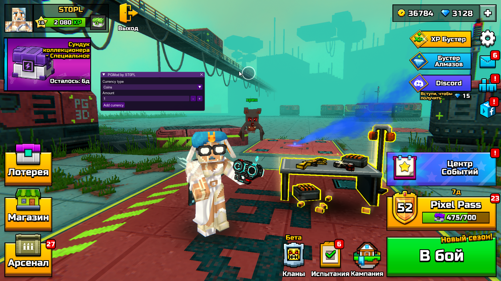

# Pixel Gun 3D: PC Edition mod-menu
## Features
- Add the following currencies:
  - Coins
  - GemsCurrency
  - ClanSilver
  - ClanLootBoxPoints
  - Coupons
  - PixelPassCurrency
  - TicketsCurrency
## How to build
1. Run `BuildAOT.bat` in `PGMod/` folder
2. Build `Injector` project
3. Run Pixel Gun 3D: PC Edition
4. Run injector
>[!NOTE]
>Building requires **.NET SDK 10 or later** installed on your system.

>[!TIP]
>You can use prebuilt binaries from the [latest release](https://github.com/ST0PL/PGMod/releases/latest).

>[!WARNING]
>Third-party injectors without export callers won't work because initialization proceeds via `Init` method independent of `DllMain` due to NativeAOT architecture.
## Screenshots

## Credits
 - Bytes patterns and signatures for functions - [PG3DUnlocker](https://github.com/stanuwu/PG3DUnlocker)